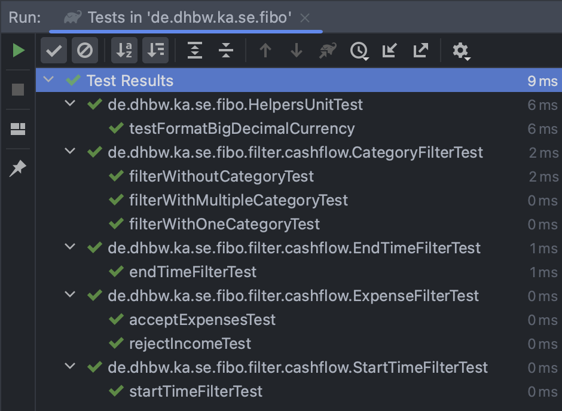
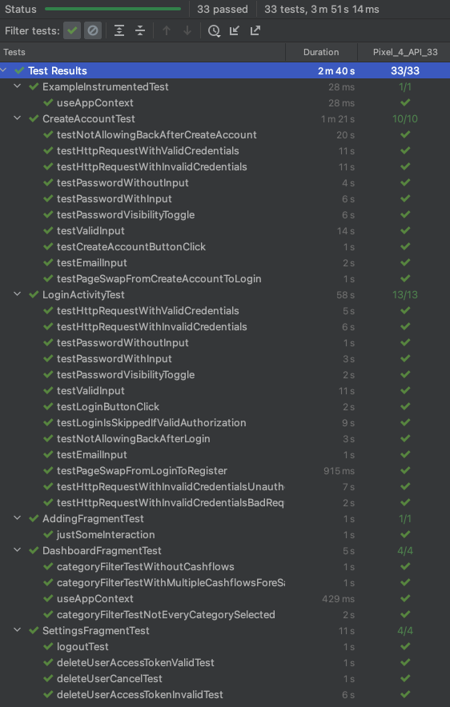
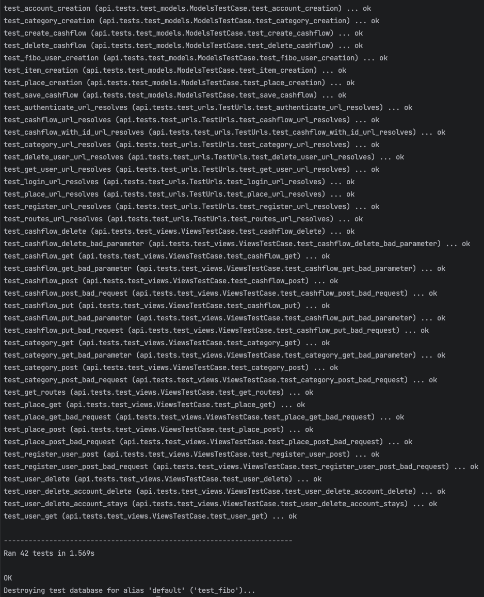
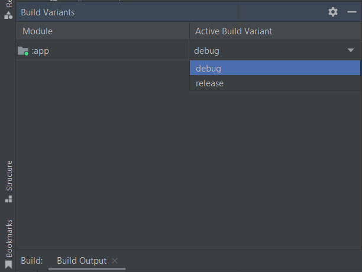

# FiBo Main Test Plan

Version: 1.0

> Note: The following template is provided for use with the Rational Unified Process. Text displayed like this is included to provide guidance to the author and should be deleted before publishing the document.

Adapted according to: <https://sceweb.uhcl.edu/helm/RationalUnifiedProcess/webtmpl/templates/test/rup_tstpln.htm>

## Revision History

| Date     | Version     | Description | Author |
| -------- | --------    | -------- | -------- |
| 31/05/2023     | 1.0        | Initial version     | FiBo Team (Chris, Jens, Jonas, Markus, Lars)     |

## Table of Contents

<!-- TOC -->

- [FiBo Main Test Plan](#fibo-main-test-plan)
  - [Revision History](#revision-history)
  - [Table of Contents](#table-of-contents)
  - [Main Test Plan](#main-test-plan)
    - [Introduction](#1-introduction)
      - [Purpose](#11-purpose)
      - [Scope](#12-scope)
      - [Intended Audience](#13-intended-audience)
      - [Document Terminology and Acronyms](#14-document-terminology-and-acronyms)
      - [References](#15-references)
    - [Evaluation Mission and Test Motivation](#2-evaluation-mission-and-test-motivation)
      - [Background](#21-background)
      - [Evaluation Mission](#22-evaluation-mission)
      - [Test Motivators](#23-test-motivators)
    - [Target Test Items](#3-target-test-items)
    - [Outline of Planned Tests](#4-outline-of-planned-tests)
      - [Outline of Test Inclusions](#41-outline-of-test-inclusions)
      - [Outline of Other Candidates for Potential Inclusion](#42-outline-of-other-candidates-for-potential-inclusion)
      - [Outline of Test Exclusions](#43-outline-of-test-exclusions)
    - [Test Approach](#5-test-approach)
      - [Initial Test-Idea Catalogs and Other Reference Sources](#51-initial-test-idea-catalogs-and-other-reference-sources)
      - [Testing Techniques and Types](#52-testing-techniques-and-types)
        - [Data and Database Integrity Testing](#521-data-and-database-integrity-testing)
        - [Function Testing](#522-function-testing)
        - [Business Cycle Testing](#523-business-cycle-testing)
        - [User Interface Testing](#524-user-interface-testing)
        - [Performance Profiling](#525-performance-profiling)
        - [Load Testing](#526-load-testing)
        - [Stress Testing](#527-stress-testing)
        - [Volume Testing](#528-volume-testing)
        - [Security and Access Control Testing](#529-security-and-access-control-testing)
        - [Failover and Recovery Testing](#5210-failover-and-recovery-testing)
        - [Configuration Testing](#5211-configuration-testing)
        - [Installation Testing](#5212-installation-testing)
    - [Entry and Exit Criteria](#6-entry-and-exit-criteria)
      - [Test Plan](#61-test-plan)
        - [Test Plan Entry Criteria](#611-test-plan-entry-criteria)
        - [Test Plan Exit Criteria](#612-test-plan-exit-criteria)
        - [Suspension and Resumption Criteria](#613-suspension-and-resumption-criteria)
      - [Test Cycles](#62-test-cycles)
        - [Test Cycle Entry Criteria](#621-test-cycle-entry-criteria)
        - [Test Cycle Exit Criteria](#622-test-cycle-exit-criteria)
        - [Test Cycle Abnormal Termination](#623-test-cycle-abnormal-termination)
    - [Deliverables](#7-deliverables)
      - [Test Evaluation Summaries](#71-test-evaluation-summaries)
      - [Reporting on Test Coverage](#72-reporting-on-test-coverage)
      - [Perceived Quality Reports](#73-perceived-quality-reports)
      - [Incident Logs and Change Requests](#74-incident-logs-and-change-requests)
      - [Smoke Test Suite and Supporting Test Scripts](#75-smoke-test-suite-and-supporting-test-scripts)
      - [Additional Work Products](#76-additional-work-products)
        - [Detailed Test Results](#761-detailed-test-results)
        - [Additional Automated Functional Test Scripts](#762-additional-automated-functional-test-scripts)
        - [Test Guidelines](#763-test-guidelines)
        - [Traceability Matrices](#764-traceability-matrices)
    - [Testing Workflow](#8-testing-workflow)
    - [Environmental Needs](#9-environmental-needs)
      - [Base System Hardware](#91-base-system-hardware)
      - [Base Software Elements in the Test Environment](#92-base-software-elements-in-the-test-environment)
      - [Productivity and Support Tools](#93-productivity-and-support-tools)
      - [Test Environment Configurations](#94-test-environment-configurations)
    - [Responsibilities, Staffing, and Training¥ Needs](#10-responsibilities-staffing-and-training-needs)
      - [People and Roles](#101-people-and-roles)
        - [Human Resources](#human-resources)
      - [Staffing and Training Needs](#102-staffing-and-training-needs)
    - [Iteration Milestones](#11-iteration-milestones)
    - [Risks, Dependencies, Assumptions, and Constraints](#12-risks-dependencies-assumptions-and-constraints)
    - [Management Process and Procedures](#13-management-process-and-procedures)
      - [Measuring and Assessing the Extent of Testing](#131-measuring-and-assessing-the-extent-of-testing)
      - [Problem Reporting, Escalation, and Issue Resolution](#132-problem-reporting-escalation-and-issue-resolution)

<!-- /TOC -->

## Main Test Plan

### 1. Introduction

#### 1.1 Purpose

The purpose of the Iteration Test Plan is to gather all the information necessary to plan and control the test effort for the given iteration. It describes the approach to the testing of the software and is the top-level plan generated and used by the managers to direct the test effort

This Test Plan document for FiBo supports the following objectives:

<!--
> - Identifies the items that should be targeted by the tests.
> - Identifies the motivation for and ideas behind the test areas to be covered.
> - Outlines the testing approach that will be used.
> - Identifies the required resources and provides an estimate of the test efforts.
> - Lists the deliverable elements of the test project.
-->
- Determining specific components that will be the focus of the tests
- Clarifying the reasons and concepts behind the test areas that need to be covered
- Defining the testing approach that will be employed
- Identifying the required resources and providing an estimate of the testing efforts
- Enumerating the deliverable elements of the test project

#### 1.2 Scope
<!--
> Describe the levels of testing (for example, Unit, Integration, or System, and the types of testing (such as Functionality, Usability, Reliability, Performance, and Supportability) that will be addressed by this **Test Plan**. It is also important to provide a general indication of significant areas that will be **excluded** from scope, especially where the intended audience might otherwise reasonably assume the inclusion of those areas.

> **Note**: Avoid placing detail here that you will repeat in sections 3, Target Test Items, and 4, Outline of Planned Tests.
-->
The purpose of this document is to describe the used tests and give a description of our test workflow.

Besides the manual tests by our developers, FiBo is constantly tested by unit tests, UI tests and integration tests.

#### 1.3 Intended Audience
<!--
> Provide a brief description of the audience for whom you are writing the **Test Plan**. This helps readers of your document identify whether it is a document intended for their use, and helps prevent the document from being used inappropriately.

> **Note**: The document style and content often alters in relation to the intended audience.
This section should only be about three to five paragraphs in length.
-->
This document is intended to inform interested parties about the testing at FiBo.
For us, the developers of FiBo, it is a way to document the tests. Other development teams can get an insight into our test architecture and compare it with their own. For stakeholders, it is also interesting to see how our app is tested.

Additionally, the document will be referenced on our blog to make interested parties aware of its existence.

#### 1.4 Document Terminology and Acronyms
<!--
> This subsection provides the definitions of any terms, acronyms, and abbreviations required to properly interpret the Test Plan. Avoid listing items that are generally applicable to the project as a whole and that are already defined in the project's Glossary. Include a reference to the project's Glossary in the References section.
-->
| Acronym | Spelled out |
| --- | --- |
| FiBo  | Finance book |
| UI     | User interface     |
| CI | Continuous integration |
| CD | Continuous deployment |
| API | Application programming interface |
| n/a | Not applicable |

#### 1.5 References
<!--
> This subsection provides a list of the documents referenced elsewhere within the Test Plan. Identify each document by title, version (or report number if applicable), date, and publishing organization or original author. Avoid listing documents that are influential but not directly referenced. Specify the sources from which the "official versions" of the references can be obtained, such as intranet UNC names or document reference codes. This information may be provided by reference to an appendix or to another document.
-->
| Title | Link |
| -------- | -------- |
| Blog     | [Wordpress](https://wordpress.com/view/fibo952390745.wordpress.com) |
| Code | [GitHub](https://github.com/Cebox82/FiBo/tree/master/android-app) |
| Documents | [GitHub](https://github.com/Cebox82/FiBo/tree/master/docs) |
| Codecov | [Codecov](https://app.codecov.io/gh/Cebox82/FiBo) |
| SonarCloud | [SonarCloud](https://sonarcloud.io/summary/new_code?id=Cebox82_FiBo) |
| Backend README | [GitHub](https://github.com/Cebox82/FiBo/blob/master/backend/README.md) |
| CI/CD | [GitHub](https://github.com/Cebox82/FiBo/actions) |

<!--
#### 1.6 Document Structure
> This subsection outlines what the rest of the Test Plan contains and gives an introduction to how the rest of the document is organized. This section may be eliminated if a Table of Contents is used.
> -->

### 2. Evaluation Mission and Test Motivation
<!--
> Provide an overview of the mission and motivation for the testing that will be conducted in this iteration.
-->
At FiBo, we aim for the app to run as smoothly and as well as possible. Using our app should feel good and thus the number of bugs and errors that occur should be minimized.

That is why we want our code to be tested regularly and whenever we make a change, to ensure that all features always work properly.

#### 2.1 Background
<!--
> Provide a brief description of the background surrounding why the test effort defined by this Test Plan will be undertaken. Include information such as the key problem being solved, the major benefits of the solution, the planned architecture of the solution, and a brief history of the project. Where this information is defined in other documents, you can include references to those other more detailed documents if appropriate. This section should only be about three to five paragraphs in length.
-->
Regularly testing our app ensures a smooth performance. By conducting consistent testing, we are able to identify and address any issues or bugs that may affect the user experience. This helps in providing an enjoyable app usage, which leads to higher user satisfaction.
It also allows us to optimize our app's performance, responsiveness, and resource usage, resulting in better overall efficiency.

#### 2.2 Evaluation Mission
<!--
> Provide a brief statement that defines the mission for the evaluation effort in the current iteration. This statement might incorporate one or more concerns including:
> - find as many bugs as possible
> - find important problems
> - assess perceived quality risks
> - advise about perceived project risks
> - certify to a standard
> - verify a specification (requirements, design or claims)
> - advise about product quality
> - satisfy stakeholders
> - advise about testing
> - fulfill process mandates
> - and so forth…

> Each mission provides a different context to the test effort and alters the way in which testing should be approached.
-->
Our most important goal is to achieve excellent results through regular and complete testing of our code.
By detecting as many errors as possible, fixing critical issues, enabling a high quality standard, and ensuring customer satisfaction, we strive to deliver excellent and reliable software.

#### 2.3 Test Motivators
<!--
> Provide an outline of the key elements that will motivate the testing effort in this iteration. Testing will be motivated by many things¾quality risks, technical risks, project risks, use cases, functional requirements, nonfunctional requirements, design elements, suspected failures or faults, change requests, and so forth.
-->
- Quality Assurance
  - Thorough testing improves our app reliability and the user experience by identifying and fixing bugs and issues
- User Satisfaction
  - Testing ensures a smooth, error-free experience, leading to happier users who are more likely to recommend our app
- Functional Validation
  - Testing confirms that our app's features and functionalities work correctly
- Security and Reliability
  - Testing helps identify and address vulnerabilities and protects user data, allowing us to keep users' trust

### 3. Target Test Items

The listing below identifies those test items software, hardware, and supporting product elements that have been identified as targets for testing. This list represents what items will be tested.

<!--
> Provide a high level list of the major target test items. This list should include both items produced directly by the project development team and items that those products rely on. For example, basic processor hardware, peripheral devices, operating systems, third-party products or components, and so forth. Consider grouping the list by category and assigning relative importance to each motivator.
-->
- User Interface
- Backend API
- Logic of our app
- Features of our app
- Constraints set by us

### 4. Outline of Planned Tests
<!--
> This section presents the recommended resources for FiBo, their main responsibilities, and their knowledge or skill set.
-->

#### 4.1 Outline of Test Inclusions
<!--
> This section provides a high-level outline of the testing that will be performed. The outline in this section represents a high level overview of both the tests that will be performed and those that will not.
-->
- User Interface Tests
- Unit Tests
- Integration Tests

#### 4.2 Outline of Other Candidates for Potential Inclusion
<!--
> Separately outline test areas you suspect might be useful to investigate and evaluate, but that have not been sufficiently researched to know if they are important to pursue.
-->
(n/a, because we think that we cover everything necessary with our current tests so far.)

#### 4.3 Outline of Test Exclusions
<!--
> Provide a high level outline of the potential tests that might have been conducted, but that have been **explicitly** excluded from this plan. If a type of test will not be implemented and executed, indicate this in a sentence stating the test will not be implemented or executed, and stating the justification, such as:
> - "These tests do not help achieve the evaluation mission."
> - "There are insufficient resources to conduct these tests."
> - "These tests are unnecessary due to the testing conducted by xxxx."
As a heuristic, if you think it would be reasonable for one of your audience members to expect a certain aspect of testing to be included that you will not or cannot address, you should note its exclusion. If the team agrees the exclusion is obvious, you probably don't need to list it.
-->

(n/a, because we consider our current tests sufficient, covering all the necessary aspects.)

### 5. Test Approach

#### 5.1 Initial Test-Idea Catalogs and Other Reference Sources

- <https://www.ibm.com/topics/software-testing>
- <https://www.atlassian.com/continuous-delivery/software-testing/types-of-software-testing>

#### 5.2 Testing Techniques and Types

##### 5.2.1 Data and Database Integrity Testing

| What? | How? |
| -------- | -------- |
| Technique Objective: | Exercise database access and observe behaviour    |
| Technique: | Execute queries and observe desired results with other queries|
| Oracles: | Queries will store and delete data which will be represented in the database |
| Required Tools: | Django |
| Success Criteria: | All tests pass without errors |
| Special Considerations: | - |

##### 5.2.2 Function Testing

| What? | How? |
| -------- | -------- |
| Technique Objective: | Assert correct behavior of each functionality of the project |
| Technique: | Execute unit tests for each functionality specified by the use-cases  |
| Oracles: | Successful execution of unit tests using the JUnit Test Runner - Successful execution of unit tests on build |
| Required Tools: | JUnit |
| Success Criteria: | All tests pass and the required code coverage is given. |
| Special Considerations: | - |

##### 5.2.3 Business Cycle Testing

(n/a because we have no external dependencies or other business to support)

##### 5.2.4 User Interface Testing

| What? | How? |
| -------- | -------- |
| Technique Objective: | Simulating UI interactions by a user |
| Technique: | Execute each use-case scenario’s individual use-case flows or functions and features, using valid and invalid data |
| Oracles: | user enter valid data, for example a valid username and a valid password |
| Required Tools: | JUnit, Espresso |
| Success Criteria: | All tests pass and the required code coverage is given. |
| Special Considerations: | Make sure the UI doesn't "hang" and all is fast enough |

##### 5.2.5 Performance Profiling

(n/a because already included in 5.2.4)

##### 5.2.6 Load Testing

(n/a because at this stage, we don't want load to be simulated)

##### 5.2.7 Stress Testing

(n/a because at this stage, we aren't production-ready and hence don't need numbers on how many instances are needed to ensure smooth operations)

##### 5.2.8 Volume Testing

(n/a at this stage, see 5.2.7)

##### 5.2.9 Security and Access Control Testing

| What? | How? |
| -------- | -------- |
| Technique Objective: | Assert that use case might only be performed by a given logged in user and the user can only access their own data. |
| Technique: | Execute each use-case scenario’s individual use-case flows or functions and features, using valid and invalid data |
| Oracles: | user enter valid data, for example a valid username and a valid password |
| Required Tools: | JUnit, Espresso |
| Success Criteria: | All tests pass and the required code coverage is given. |
| Special Considerations: | - |

##### 5.2.10 Failover and Recovery Testing

(n/a because we don't strive for high availabilty at this time)

##### 5.2.11 Configuration Testing

(n/a because there are no settings to test)

##### 5.2.12 Installation Testing

| What? | How? |
| -------- | -------- |
| Technique Objective: | Exercise the installation of the target-of-test onto each required hardware configuration under the following conditions to observe and log installation behavior and configuration state changes |
| Technique: | Manual performed installation |
| Oracles: | The app can be installed and used on Android devices |
| Required Tools: | Android > 8|
| Success Criteria: | installation successful |
| Special Considerations: | - |

### 6. Entry and Exit Criteria

### 6.1 Test Plan

#### 6.1.1 Test Plan Entry Criteria

Building a new version of the software will execute the test process.

#### 6.1.2 Test Plan Exit Criteria

When all tests pass without throwing an exception.

#### 6.1.3 Suspension and Resumption Criteria

The test plan is not supposed to be suspended. Therefore, there are no suspension and resumption criteria.

### 6.2 Test Cycles

#### 6.2.1 Test Cycle Entry Criteria

A test cycle begins when the build of a new version is initiated.

#### 6.2.2 Test Cycle Exit Criteria

The test effort of a cycle is deemed sufficient when a build has been completed without failures and all unit tests are run successfully.

#### 6.2.3 Test Cycle Abnormal Termination

Occurring errors during the build terminate the test cycle.

### 7. Deliverables

#### 7.1 Test Evaluation Summaries

Test evaluation will be available online every time a Pull Request is merged into the main branch. The report is generated with the help of [CodeCov](https://codecov.io/gh/Cebox82/FiBo).

#### 7.2 Reporting on Test Coverage

After building and testing the master branch the resulting coverage is uploaded to [CodeCov](https://codecov.io/gh/Cebox82/FiBo).

#### 7.3 Perceived Quality Reports

Code quality will be measured with SonarCloud. It will create a report for every pull request. The quality report status is showed by the following badge:

#### 7.4 Incident Logs and Change Requests

(n/a, we are happy to have them communicated to us directly)

#### 7.5 Smoke Test Suite and Supporting Test Scripts

(n/a, because there is no smoke testing)

#### 7.6 Additional Work Products

##### 7.6.1 Detailed Test Results

The following screenshot shows the unit test results after running with Android Studio:

This screenshot shows the results of running the UI tests:

This screenshot shows the results of running the Backend Django tests:

##### 7.6.2 Additional Automated Functional Test Scripts

(n/a because when running the UI tests, you already have everything scripted)

##### 7.6.3 Test Guidelines

In general all testable code should be tested. Due to time constraint this is of course not always possible. Therefore, we set a bound of 70% for coverage.

##### 7.6.4 Traceability Matrices

(n/a, because there is no predecessor nor successor to trace changes of)

### 8. Testing Workflow

There are currently 3 ways to test our product:
First approach (CI):

1. Clone the [code](https://github.com/Cebox82/FiBo) to your GitHub repository
2. Add every secret as seen in the [backend README](https://github.com/Cebox82/FiBo/blob/master/backend/README.md) to the GitHub repository as described [here](https://docs.github.com/en/actions/security-guides/encrypted-secrets#creating-encrypted-secrets-for-a-repository)
3. Commit to a branch of your choice and check if the following jobs are successfull: Android CI (for android UI and Unit tests), Django CI (for backend tests)

Second approach (Emulator):

1. Clone the [code](https://github.com/Cebox82/FiBo) to your local development machine
2. Set up an android device emulator in android-studio as decribed [here](https://developer.android.com/studio/run/managing-avds)
3. Follow the instructions in the [backend README](https://github.com/Cebox82/FiBo/blob/master/backend/README.md)
4. Start the newly created docker container
5. Open the android app in Android Studio with the /android-app subfolder as root source
6. Do a Gradle sync
7. Right click on the test folders located in the /src subfolder
8. Click "Run All Tests" (The results should be the same as "Android CI" results)

If you want to test everything by hand, be sure to set the Build Variants as whished. Ideally you should use "release" if you want to interact with the backend.

After that, you can run the emulator. Just click on "app" to select the correct run configuration.

Third approach (Real Android Device):

1. Clone the [code](https://github.com/Cebox82/FiBo) to your local development machine
2. Start the Project in Android Studio
3. Click on the menu option `Build` at the top
4. Select the submenu `BuildBundle(s) / APK`
5. Select `Build APK(s)`
6. go to `FiBo\android-app\app\build\outputs\apk\debug` and save the `app-debug.apk` from your development machine to your android device with (USB / Bluetooth /...)
7. Install FiBo
    - If the installation is possible you can feel free to test the FiBo app
    - If the Installation is not possible you might need to adjust some settings
        9.1. Check if you've allowed the setting allow [installation from unkown sources](https://www.maketecheasier.com/install-apps-from-unknown-sources-android/) in your android device
        9.2 Click "See details" and then "Install anyways" if google play protect prevents an easy installation
8. If asked, please grant FiBo any permissions it needs

If you want to test everything by hand, be sure to set the Build Variants as whished. Ideally you should use "release" if you want to interact with the backend.

After that, you can run the emulator. Just click on "app" to select the correct run configuration.

### 9. Environmental Needs

This section presents the non-human resources required for the Test Plan.

#### 9.1 Base System Hardware

The following table sets forth the system resources for the test effort presented in this Test Plan.

| Resource | Quantity | Name and Type |
| -------- | -------- | -------- |
| Code Repository | 1 | Github |
| CI/CD server | 1 | Github Actions |
| Docker | 1 | Containerized backend environment |
| local test and build machine | 1 | Computer |
| Android test device (at least Android 8.0) | 1 | Android mobile phone |

#### 9.2 Base Software Elements in the Test Environment

The following base software elements are required in the test environment for this Test Plan.

| Software Element Name | Type |
| -------- | -------- |
| Android Studio (at least Flamingo v. 2022.2.1) | Test Runner / IDE |
| IntelliJ | Test Runner / IDE |
| Docker     | Containerized backend environment |

#### 9.3 Productivity and Support Tools

The following will be employed to support the test process for this Test Plan.

| Tool Category or Type | Tool Brand Name |
| -------- | -------- |
| Repository     | [github.com](https://github.com/Cebox82/FiBo)|
| Test Coverage Monitor     | [codecov.io](https://app.codecov.io/gh/Cebox82/FiBo)|
| CI/CD     | [github actions](https://github.com/Cebox82/FiBo/actions)|
| Metrics Tool     | [sonarcloud](https://sonarcloud.io/project/overview?id=Cebox82_FiBo)|

#### 9.4 Test Environment Configurations

(n/a, because the configurations are stored in the workflow files (for CI) and the README)

### 10. Responsibilities, Staffing, and Training Needs

This section presents the required resourses to address the test effort in the Test Plan; the main responsibilities, and the knowledge or skill sets required of those resources.

#### 10.1 People and Roles

This table shows the staffing assumptions for the test effort.

##### Human Resources

| Role | Minimum Resources Recommended (number of full-time roles allocated) | Specific Responsbilities or Comments |
| -------- | -------- | -------- |
| Test Manager     | Jens     | Provides management oversight. Responsibilities include: 1. planning and logistics, 2. agree mission, 3. identify motivators, 4. acquire appropriate resources, 5. present management reporting, 5. advocate the interests of test, 6. evaluate effectiveness of test effort |
| Test Analyst     | Chris, Jens, Jonas, Lars, Markus     | Identifies and defines the specific tests to be conducted.  Responsibilities include: 1. identify test ideas 2. define test details 3. determine test results 4. document change requests 5. evaluate product quality  |
| Test Designer     | Chris, Jens, Jonas, Lars, Markus     | Defines the technical approach to the implementation of the test effort. Responsibilities include:      define test approach, define test automation architecture, verify test techniques, define testability elements, structure test implementation  |
| Tester     | Chris, Jens, Jonas, Lars, Markus | Implements and executes the tests.  Responsibilities include: implement tests and test suites, execute test suites, log results, analyze and recover from test failures     document incidents |
| Test System Administrator | n/a | Ensures test environment and assets are managed and maintained. Responsibilities include: administer test management system, install and support access to, and recovery of, test environment configurations and test labs |
| Database Administrator, Database Manager |Jens, Markus | Ensures test data (database) environment and assets are managed and maintained. Responsibilities include: support the administration of test data and test beds (database) |
| Designer | n/a | Identifies and defines the operations, attributes, and associations of the test classes. Responsibilities include: defines the test classes required to support testability requirements as defined by the test team |
| Implementer     | Chris, Jens, Jonas, Lars, Markus| Implements and unit tests the test classes and test packages. Responsibilities include: creates the test components required to support testability requirements as defined by the designer |

#### 10.2 Staffing and Training Needs

By rotating roles and tasks often during implementation and trying to be as flexible as possible, we don't have any specific training that is required. Everyone learns from their peers, so by the end of the project everyone is at the same level. In general it is a kind of Just-In-Time approach as we learn things whenever it is needed.
Hence, there is no specific training need for executing this testing plan.

### 11. Iteration Milestones

> Identify the key schedule milestones that set the context for the Testing effort. Avoid repeating too much detail that is documented elsewhere in plans that address the entire project.

| Milestone | Planned Start Date | Actual Start Date | Planned End Date | Actual End Date |
| -------- | -------- | -------- | -------- | -------- |
| Having unit tests    | 12.04.2023     | 13.04.2023     | 20.06.2023     | -     |
| Having espresso test     | 24.04.2023     | 26.04.2023     | 23.06.2023     | -     |
| Having CI in GitHub     | 24.04.2023     | 24.04.2023     | 30.06.2023     | -     |
| 50 % Test Coverage     | 25.04.2023     | 28.04.2023     | 30.06.2023     | -     |

### 12. Risks, Dependencies, Assumptions, and Constraints

| Risk | Mitigation Strategy | Contingency (Risk is realized) |
| -------- | -------- | -------- |
| Inexperience     | Mutual support     | High     |
| Insufficient time planning     | Setting realistic milestones and deadlines. Monitoring of progress and early identification of delays.     | High     |
| Communication problems     | Regular meetings and status updates     | Middle     |

---

| Dependency between | Potential Impact of Dependency | Owners |
| -------- | -------- | -------- |
| Tickets     | Delay in completion of tasks due to dependent tickets     | Development team, project manager     |
| Merging of branches     | Delay in continuing work on a ticket until the corresponding branch is merged into the main branch     | Development team, project manager     |

---

| Constraint on | Impact Constraint has on test effort | Owners |
| -------- | -------- | -------- |
| Time     | Limited time available for testing leads to compromises in test coverage and potentially undetected errors     | Project manager, tester     |
|Changes in the project scope|Frequent changes in project scope require constant adjustments to the test plan and can affect test coverage|Project manager, tester|

### 13. Management Process and Procedures

#### 13.1 Measuring and Assessing the Extent of Testing

To track the scope of the tests, the tools Codecov and SonarCloud are used, integrated through GitHub Actions. These tools provide metrics and measurements to evaluate test coverage and track the progress of the test scope. Regular evaluations and reports are generated to measure and assess the current test scope.

#### 13.2 Problem Reporting, Escalation, and Issue Resolution

- Jens (Product Owner)
