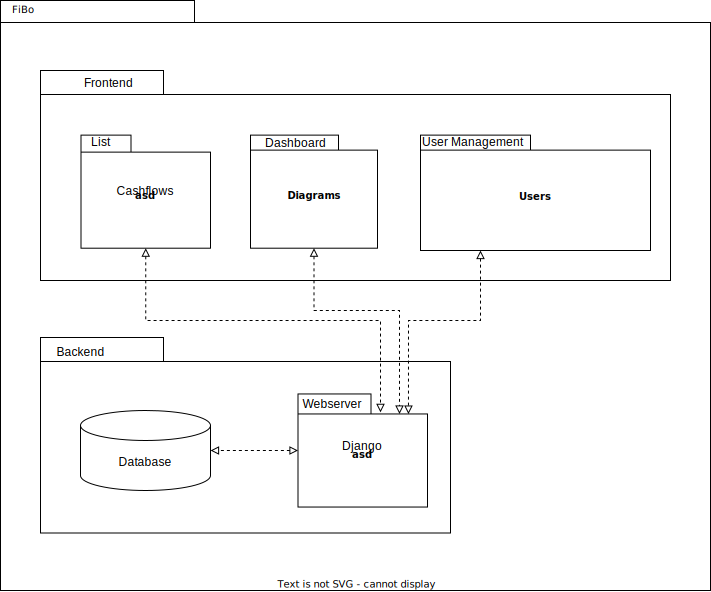

# FiBo: Software Architecture Document

## Attribution
This document is based on the following template: https://sce.uhcl.edu/helm/RationalUnifiedProcess/webtmpl/templates/a_and_d/rup_sad.htm

**Version: 1.0**

## Revision History

| Date (dd/mm/yy) | Version | Description | Author |
|---|---|---|---|
| 22/11/22 | 1.0 | Initial version | Jens |
| 12/04/23 | 1.1 | Extended version | Jens |

## Table of Contents

> TODO: Generate TOC

## Software Architecture Document
#### Purpose

This document provides a comprehensive architectural overview of the system, using a number of different architectural views to depict different aspects of the system. It is intended to capture and convey the significant architectural decisions which have been made on the system.

#### Scope
The scope of this Software Architecture document is to show the architecture of the FiBo project. We illustrate the use cases and the overall structure.

#### Definitions, Acronyms and Abbreviations

| Abbreviation | Description |
| --- | --- |
| API | Application Programming Interface |
| SRS | Software Requirement Specification |
| n/a | not applicable |
| UC | use case |
| CRUD | create-read-update-delete |

#### References

| Name and link | Date | Publishing organization |
| --- | --- | --- |
| [Blog](https://fibo952390745.wordpress.com/) | ongoing | FiBo project team |
| [Git repository](https://github.com/Cebox82/FiBo) | ongoing | FiBo project team |
| [SRS](https://github.com/Cebox82/FiBo/blob/master/docs/SRS.md) | 16/11/2022 | FiBo project team |
| [UC 4 - Manual adding of data](https://github.com/Cebox82/FiBo/blob/master/docs/use_cases/UC_4_manual_adding_of_data/UC_4_manual_adding_of_data.md) | 21/11/2022 | FiBo project team |

#### Overview

This document contains the Architectural Representation, Goals and Constraints as well as the Logical, Deployment, Implementation and Data Views.

### Architectural Representation

The backend (Django based) and the frontend are both developed separted from each other and only communicate over a REST API. That said, it is hard to follow one of the known patterns (MVC, MVP, MVVM) for the whole project, as the frontend ecosystem (an Android app) can only be so much used to follow one of some known pattterns.

Please also see this [introduction to the technologies](https://fibo952390745.wordpress.com/2022/10/18/week-2-roles-and-technologies/).

### Architectural Goals and Constraints

#### Architectural Goals
The architectural goals of the FiBo app are to provide users with a comprehensive platform for learning and managing personal finances. The app should be user-friendly, with an intuitive interface that enables users to easily access their personal financial information and tools. It should also be secure, with robust data encryption and authentication protocols to protect user data.

#### Architectural Constraints
The architectural constraints of FiBo include technical limitations, such as various screen sizes. There are also operational constraints such as time and budget limitations as well as a team of developers with a big variety of experiences.

#### Assumptions
The finance book app assumes that users will have varying levels of financial literacy and experience. Therefore, it should provide a range of resources, from basic data entry to allowing users to enter more data to enable a detailed analysis of their data.

#### Risks and trade-offs
The risks associated with FiBo include potential security breaches or data leaks, which could lead to loss of user data or financial information. To mitigate these risks, the app will require robust security measures and regular updates to ensure that any potential vulnerabilities are addressed promptly. The trade-offs associated with the finance book app include balancing the desire for rich functionality with ease of use and simplicity for users.

### Use-Case View

See [3.1 in our SRS](SRS.md#31-functionality).

#### Use-Case Realizations

[This section illustrates how the software actually works by giving a few selected use-case (or scenario) realizations, and explains how the various design model elements contribute to their functionality.]

### Logical View

[This section describes the architecturally significant parts of the design model, such as its decomposition into subsystems and packages. And for each significant package, its decomposition into classes and class utilities. You should introduce architecturally significant classes and describe their responsibilities, as well as a few very important relationships, operations, and attributes.]

#### Overview

We have, for now, two packages that interact with each other: the frontend and the backend.

The backend mainly serves requests for the frontend, which is entitled to the entire CRUD workflow. A special focus is on serving requests that relate to retrieving previously created or updated data, so it can be visualized nicely.

The frontend is in charge of providing a human-useable interface that provides functionality to create, read, update and delete data.

#### Architecturally Significant Design Packages

##### Android app

##### Django Backend

[For each significant package, include a subsection with its name, its brief description, and a diagram with all significant classes and packages contained within the package.

For each significant class in the package, include its name, brief description, and, optionally a description of some of its major responsibilities, operations and attributes.]

### Process View

[This section describes the system's decomposition into lightweight processes (single threads of control) and heavyweight processes (groupings of lightweight processes). Organize the section by groups of processes that communicate or interact. Describe the main modes of communication between processes, such as message passing, interrupts, and rendezvous.]

### Deployment View

[This section describes one or more physical network (hardware) configurations on which the software is deployed and run. It is a view of the Deployment Model. At a minimum for each configuration it should indicate the physical nodes (computers, CPUs) that execute the software, and their interconnections (bus, LAN, point-to-point, and so on.) Also include a mapping of the processes of the Process View onto the physical nodes.]

### Implementation View

[This section describes the overall structure of the implementation model, the decomposition of the software into layers and subsystems in the implementation model, and any architecturally significant components.]

#### Overview

[This subsection names and defines the various layers and their contents, the rules that govern the inclusion to a given layer, and the boundaries between layers. Include a component diagram that shows the relations between layers. ]

#### Layers

[For each layer, include a subsection with its name, an enumeration of the subsystems located in the layer, and a component diagram.]

### Data View (optional)

[A description of the persistent data storage perspective of the system. This section is optional if there is little or no persistent data, or the translation between the Design Model and the Data Model is trivial.]

### Size and Performance

REST API interaction are designed for brevity to eliminate unnecessary bytes traveling across the internet, while consuming time and other worthy resources. We will make sure to use the following terms:

| Terminology | Duration | Response |
| --- | --- | --- |
Instantaneous | up to 100ms | Acknowledge user input within this time frame. Ideally, a visible process towards the completion of the task begins within this time span (e.g. form checking).
Immediate | 500–1000ms | Answers to simple requests must be completed within this time frame
Continuous | 2000–5000ms | Answers to complex questions must be completed within this time frame (e.g. a complex dashboard should be fully loaded)
Captive | 7000–10000ms | Users will begin switching tasks at this point. If a process takes longer than this, it should be segmented.

Source (adapted after): https://design.firefox.com/photon/introduction/design-for-performance.html
<!-- Yes, I love Mozilla Firefox and it's thoughtful design process -->

We should strive for duration to be Immediate at most. In rare cases, we might be forced to have a Continous process. We should avoid Captive processes at all costs and segment these really complex tasks.

### Quality

To make sure we are able to deliver apps of great quality with even greater confidence, we want to implement UI tests that can be run automatically. Within these, we will create scenarios that will cover each aspect (even edge cases) of all the workflows and use-cases.

For the backend, first considerations are that we use an automated tool that tests the published REST API. This can also be automated.