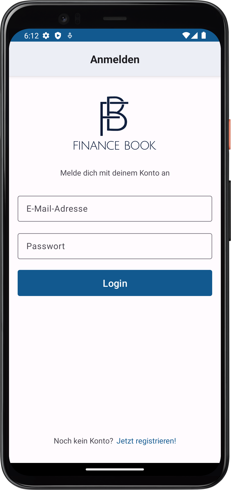
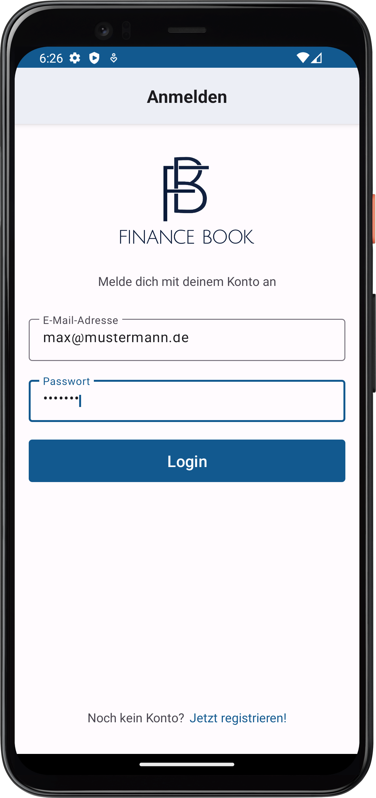
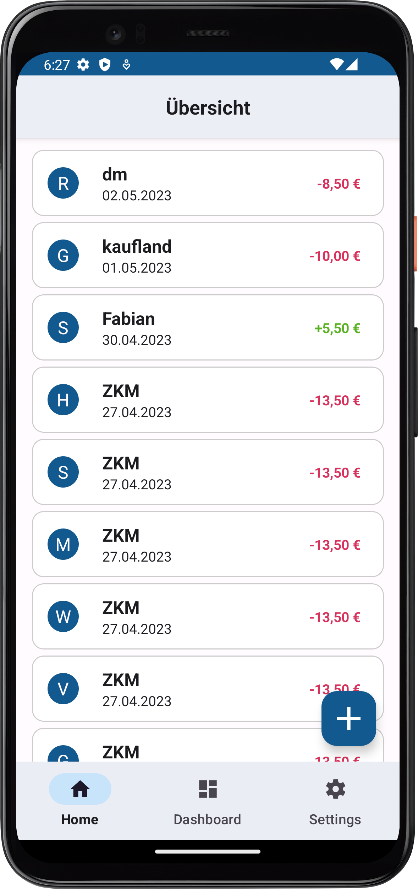
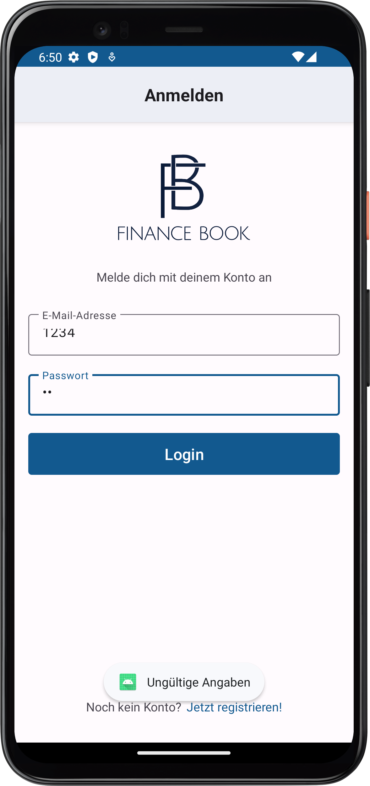

# FiBo: Software Architecture Document

## Attribution

This document is based on the following template: <https://sce.uhcl.edu/helm/RationalUnifiedProcess/webtmpl/templates/a_and_d/rup_sad.htm>

Version: 1.2

## Revision History

| Date (dd/mm/yy) | Version | Description | Author |
|---|---|---|---|
| 22/11/22 | 1.0 | Initial version | Jens |
| 12/04/23 | 1.1 | Extended version | Jens |
| 02/05/23 | 1.2 | Extended version | Jens |

## Table of Contents

> TODO: Generate TOC

## Software Architecture Document

### Purpose

This document provides a comprehensive architectural overview of the system, using a number of different architectural views to depict different aspects of the system. It is intended to capture and convey the significant architectural decisions which have been made on the system.

### Scope

The scope of this Software Architecture document is to show the architecture of the FiBo project. We illustrate the use cases and the overall structure.

### Definitions, Acronyms and Abbreviations

| Abbreviation | Description |
| --- | --- |
| API | Application Programming Interface |
| SRS | Software Requirement Specification |
| n/a | not applicable |
| UC | use case |
| CRUD | create-read-update-delete |

### References

| Name and link | Date | Publishing organization |
| --- | --- | --- |
| [Blog](https://fibo952390745.wordpress.com/) | ongoing | FiBo project team |
| [Git repository](https://github.com/Cebox82/FiBo) | ongoing | FiBo project team |
| [SRS](https://github.com/Cebox82/FiBo/blob/master/docs/SRS.md) | 16/11/2022 | FiBo project team |
| [UC 4 - Manual adding of data](https://github.com/Cebox82/FiBo/blob/master/docs/use_cases/UC_4_manual_adding_of_data/UC_4_manual_adding_of_data.md) | 21/11/2022 | FiBo project team |

### Overview

This document contains the Architectural Representation, Goals and Constraints as well as the Logical, Deployment, Implementation and Data Views.

### Architectural Representation

The backend (Django based) and the frontend are both developed separted from each other and only communicate over a REST API. That said, it is hard to follow one of the known patterns (MVC, MVP, MVVM) for the whole project, as the frontend ecosystem (an Android app) can only be so much used to follow one of some known pattterns.

Please also see our [introduction to the technologies on our blog](https://fibo952390745.wordpress.com/2022/10/18/week-2-roles-and-technologies/).


### Architectural Goals and Constraints

#### Architectural Goals

The architectural goals of the FiBo app are to provide users with a comprehensive platform for learning and managing personal finances. The app should be user-friendly, with an intuitive interface that enables users to easily access their personal financial information and tools. It should also be secure, with robust data encryption and authentication protocols to protect user data.

#### Architectural Constraints

The architectural constraints of FiBo include technical limitations, such as various screen sizes. There are also operational constraints such as time and budget limitations as well as a team of developers with a big variety of experiences.

#### Assumptions

The finance book app assumes that users will have varying levels of financial knowledge and experience. Therefore, it should provide a range of resources. To achieve this requirement the users may simply add their incomming finances in the app for a brief historical overview or use the features provided by the dashboard panel for a more detailed analysis of their data.

#### Risks and trade-offs

The risks associated with FiBo include potential security breaches or data leaks, which could lead to loss of user data or financial information. To mitigate these risks, the app will require robust security measures and regular updates to ensure that any potential vulnerabilities are addressed promptly. The trade-offs associated with the finance book app include balancing the desire for rich functionality with ease of use and simplicity for users.

For a detailed view on risks, please see [the RISKS document](RISKS.md).

### Use-Case View

Please see [section 3.1 in our SRS](SRS.md#31-functionality).

#### Use-Case Realizations

As of 2nd May, eight use-cases have been realized already.

We'll focus on describing on the use-case 3.1.2 (Logging in), as it tackles all systems.

Scenario: Logging In

1. User opens the app and is presented with a login screen.

2. User enters their email and password and clicks the "Login" button.

3. The system sends the received login credentials to the authentication and authorization process.
4. The authentication and authorization process checks the email and password against Django's backend authentication system.
5. If the email and password match, the authentication and authorization process sends a token to the application system process, allowing the user to access the app's functionality.

6. If the email and password do not match, the authentication and authorization process sends an error message to the application system process, asking the user to enter valid credentials.


How the Design Model Elements Contribute to the Functionality:

1. User Interface Design: The login screen presented to the user is a result of the user interface design. It provides an interface for the user to enter their login credentials.

2. Authentication and Authorization Model: The authentication and authorization process is a part of the authentication and authorization model. It verifies the user's email and password against Django's backend authentication system and sends a message to the application system process allowing access to the app's functionality.

3. Backend API: Django's backend authentication system is accessed through the backend API. The authentication and authorization process sends the user's login credentials to the appropriate backend API endpoint for further processing.

4. Message Passing: The message passing mechanism between the user interface process and the authentication and authorization process is essential for the login functionality to work. The application system process sends the user's login credentials to the authentication and authorization process, which then sends a message back allowing access to the app's functionality.

In conclusion, these design model elements work together to verify the user's credentials and allow access to the app's functionality.

### Logical View

[This section describes the architecturally significant parts of the design model, such as its decomposition into subsystems and packages. And for each significant package, its decomposition into classes and class utilities. You should introduce architecturally significant classes and describe their responsibilities, as well as a few very important relationships, operations, and attributes.]

#### Overview of the Logical View

We have, for now, two packages that interact with each other: the frontend and the backend.

The backend mainly serves requests for the frontend, which is entitled to the entire CRUD workflow. A special focus is on serving requests that relate to retrieving previously created or updated data, so it can be visualized nicely.

The frontend is in charge of providing a human-useable interface that provides functionality to create, read, update and delete data.

#### Architecturally Significant Design Packages

##### Android app

The Android app is what our users see and deal with.
Hence, special attention is paid to guarantee a seamless user experience in their entire lifecycle.
So, less focus is paid to deal with large chunks of data.

Significant parts as well of their technical names are:

- List of cashflows (HomeFragment)
- Adding cashflows (AddingFragment)
- Dashboard (DashboardFragment)
- Settings (SettingsFragment)

##### Django Backend

The Django Backend deals with the task of managing the data.
It is not only concerned to provide interfaces for multiple users, but also to save and retrieve big chunks of data efficiently.

Significant parts as well of their technical names are:

- Registering of users (RegisterView)
- Logging in of users (TokenObtainPairView)
- Authenticating of users (TokenRefreshView)
- Saving, updating as well as deleting cashflows (CashflowsView)
- In the future, the automatic extraction of receipts' data (tbd)

### Process View

The Android app and the Django backend will consist of multiple lightweight and heavyweight processes that communicate with each other to achieve the desired functionality. Here are some processes and modes of communication between them:

1. User Interface Process: This is the process that handles the Android app's user interface. It receives user input and sends it to other processes to handle the appropriate action. The mode of communication between this process and other processes is through message passing through Inter-Process Communication (IPC) and managed by the Android operating system.

2. Cashflow Management Process: This process manages the cashflows made by the user. It receives input from the user interface process and saves the cashflow data to the Django backend through an HTTP request. It also retrieves cashflow data from the backend and sends it to the user interface process for display. The mode of communication between this process and other processes is through message passing.

3. Data Storage Process: This process is responsible for storing cashflow data in the Django backend. It receives input from the web worker process and stores the data in the database. The mode of communication between this process and other processes is through message passing (SQL-based queries and replies).

4. Authentication and Authorization Process: This process is responsible for authenticating users and authorizing their access to the app's functionality. It receives input from the user interface process and checks the user's credentials against the Django backend's authentication system. If the user is authorized, this process sends a message back to the user interface process allowing them access to the app's functionality by issuing a JWT. The mode of communication between this process and other processes is through message passing (IPC as well as HTTP).

5. Backend Integration Process: This process is responsible for integrating the Android app with the Django backend. It is capable of managing several lightweight processes (worker threads) that send the requests asynchronously. It receives input from the user interface, and sends it to the appropriate backend API endpoint for processing. Once response data is received, it sends it to the appropriate process for display or further processing. The mode of communication between this process and other processes is through message passing using IPC as well as HTTP for the external API calls.

In summary, the main mode of communication between processes in this system is message passing. The user interface process, cashflow management process, data storage process, authentication and authorization process, and backend integration process all communicate with each other through message passing (whether it is HTTP, IPC or SQL-based).

### Deployment View

Because the software is not meant to be deployed for wide-range usage, it is only deployed for development as well as presentation purposes.

There is no need to have multiple pieces of hardware.
However, the running Android app needs to be able to connect to the backend.
This can be achieved by layer 2 networking.

From a process based view, all Android app related processes run on the (emulated) mobile phone. All other processes run inside a dockerized environment.

In case that an emulated mobile phone is used, and also the backend is running on the same physical machine, it is recommended to have at least four CPU cores.

### Implementation View

The FiBo implementation model follows a layered architecture pattern, with three core layers: the presentation layer, the application layer, and the data access layer. Each layer has its own subsystems, which are responsible for specific functionalities. The layers and subsystems are described in detail below:

1. Presentation Layer:
    The presentation layer is responsible for the app's user interface and interacts directly with the user. This layer consists of the following subsystems:
    - User Interface: This subsystem manages the Android app's user interface and handles user input and output
    - Authentication and Authorization: This subsystem is responsible for authenticating users and authorizing their access to the app's functionality.

2. Application Layer:
    The application layer provides the business logic and implements the use cases of the FiBo app. This layer consists of the following subsystems:
    - Cashflow Management: This subsystem manages the cashflows ("cash transactions") made by the user and communicates with the data access layer to store and retrieve transaction data.
    - Backend Integration: This subsystem is responsible for integrating the Android app with the Django backend and communicates with the data access layer to retrieve and send data to the backend.

3. Data Access Layer:
    The data access layer is responsible for managing the app's data and communicating with the Django backend. This layer consists of the following subsystems:
    - API Integration: This subsystem communicates with the Django backend's API to retrieve and send data to the app.
    - Data Storage: This subsystem is responsible for storing and sending data from and to the database

Architecturally significant components of the FiBo implementation model include:

1. Android SDK: This component provides the necessary tools and libraries to build the Android app's user interface and functionality.
2. Django Framework: This component provides the web framework for the backend and the ORM (Object-Relational Mapping) to interface with the database.
3. PostgreSQL: This component is the database used to store the cashflow data in the Android app as well as all things that are needed to provide this basic functionality.

In conclusion, the FiBo implementation model follows a layered architecture pattern, with each layer divided into subsystems responsible for specific functionalities. The presentation layer interacts directly with the user, the application layer provides the business logic, and the data access layer manages the app's data and communicates with the Django backend. The architecturally significant components of the implementation model include the Android SDK, Django framework, and PostgreSQL database.

#### Overview of realized implementation

The realized implementation builds upon the three layer concept described earlier.

The components in each layer are governed by the Single Responsibility Principle.
Hence, as a layer, they should be easily replacable.
For example, as we use Django's ORM abilities, it would be easy to throw away the PostgreSQL database and go with a SQLite database instead.

The diagram looks something like this:

```text
    User Interface
            |
Authentication/Authorization
            |
    Cashflow Management
            |
    Backend Integration
            |
      API Integration
            |
        Data Storage
```

#### Layers

The FiBo app's realized implementation consists of three layers, namely the Presentation Layer, Application Layer, and Data Access Layer. In this section, we will provide an overview of each layer, its associated subsystems, and a component diagram illustrating the interactions between the subsystems.

##### Presentation Layer

The Presentation Layer is the topmost layer of the FiBo app's architecture and is responsible for handling the user interface and user input/output. It consists of two subsystems: the User Interface and the Authentication and Authorization subsystems.

1. User Interface subsystem: This subsystem manages the app's user interface, such as displaying cashflows, adding cashflows, and managing user settings.
2. Authentication and Authorization subsystem: This subsystem is responsible for authenticating users and authorizing their access to the app's functionalities.

The component diagram for the Presentation Layer is as follows:

```text
User Interface
      |
Authentication
```

##### Application Layer

The Application Layer is the middle layer of the FiBo app's architecture and contains the business logic and use cases of the app. It consists of two subsystems: the Cashflow Management and the Backend Integration subsystems.

1. Cashflow Management subsystem: This subsystem manages the user's cashflows and communicates with the Data Access Layer to store and retrieve cashflow data.

2. Backend Integration subsystem: This subsystem is responsible for integrating the Android app with the Django backend and communicates with the Data Access Layer to retrieve and send data to the backend.

The component diagram for the Application Layer is as follows:

```text
Cashflow Management
        |
Backend Integration
```

##### Data Access Layer

The Data Access Layer is the bottommost layer of FiBo's architecture and is responsible for managing the app's data and communicating with the Django backend. It consists of two subsystems: the Data Storage and the API Integration subsystems.

1. API Integration subsystem: This subsystem communicates with the Django backend's API to retrieve and send data to the app.
2. Data Storage subsystem: This subsystem is responsible for storing and retrieving cashflow data into and from the database.

The component diagram for the Data Access Layer is as follows:

```text
API Integration
      |
 Data Storage
```

In conclusion, the architecutre of FiBo is organized into three layers: the Presentation Layer, Application Layer, and Data Access Layer, each of which contains two subsystems that work together to deliver the app's functionalities.

### Size and Performance

REST API interaction are designed for brevity to eliminate unnecessary bytes traveling across the internet, while consuming time and other worthy resources. We will make sure to use the following terms:

| Terminology | Duration | Response |
| --- | --- | --- |
Instantaneous | up to 100ms | Acknowledge user input within this time frame. Ideally, a visible process towards the completion of the task begins within this time span (e.g. form checking).
Immediate | 500–1000ms | Answers to simple requests must be completed within this time frame
Continuous | 2000–5000ms | Answers to complex questions must be completed within this time frame (e.g. a complex dashboard should be fully loaded)
Captive | 7000–10000ms | Users will begin switching tasks at this point. If a process takes longer than this, it should be segmented.

Source (adapted after): <https://web.archive.org/web/20220627213434/https://design.firefox.com/photon/introduction/design-for-performance.html>
<!-- Yes, I love moz://a and it's a thoughtful design process -->

We should strive for duration to be Immediate at most. In rare cases, we might be forced to have a Continous process. We should avoid Captive processes at all costs and segment these really complex tasks.

### Quality

To make sure we are able to deliver apps of great quality with even greater confidence, we want to implement UI tests that can be run automatically. Within these, we will create scenarios that will cover each aspect (even edge cases) of all the workflows and use-cases.

For the backend, first considerations are that we use an automated tool that tests the published REST API. This can also be automated.
