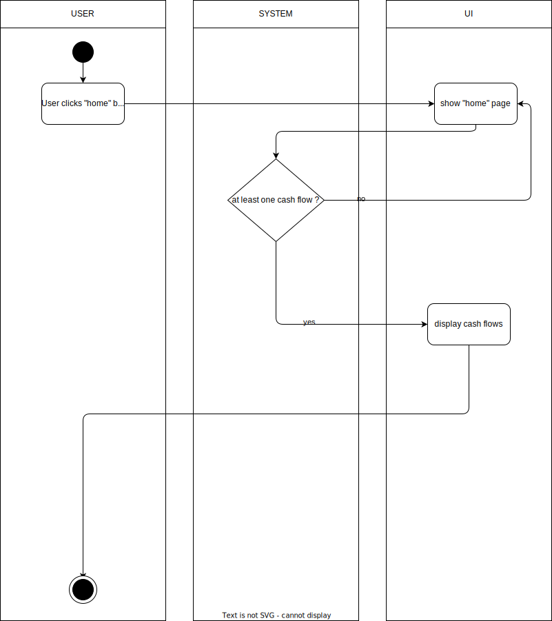
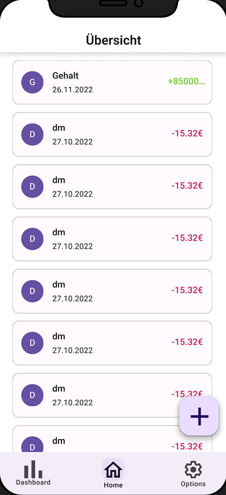

# 1. Use Case description

## Name of use case

Show incomes and expenses in a list
## 1.1 Brief Description

Every user should be able to list their different cash flows in the home dashboard. The data that is displayed per cash flow is as follows:

- date
- type of flow (expense/income)
- price
- store
- category icon

# 2 Flow of Events

## 2.1 Basic Flow

- User clicks on "Home" navigation
- User can see his cash flow history

### 2.1.1 Activity Diagram



### 2.1.2 Mock-up




### 2.1.3 Narrative

```gherkin
Feature: Show incomes and expenses in a list
  
  As a logged-in user
  I want to see a overview of the cash flows
  
  Background: 
    And I am on the homepage and logged-in
    
    Scenario: see cash flows
      Given I am signed in with username "USER" and password "PASSWORD"
      And I am on the "home" page
      Then I can see the different cash flows income and expenses

```

## 2.2 Alternative Flows

(n/a)

# 3 Special Requirements

(n/a)

# 4 Preconditions

## 4.1 Data

The user must have created at least one valid cash flow

# 5 Postconditions

(n/a)

# 6 Extension Points

(n/a)
