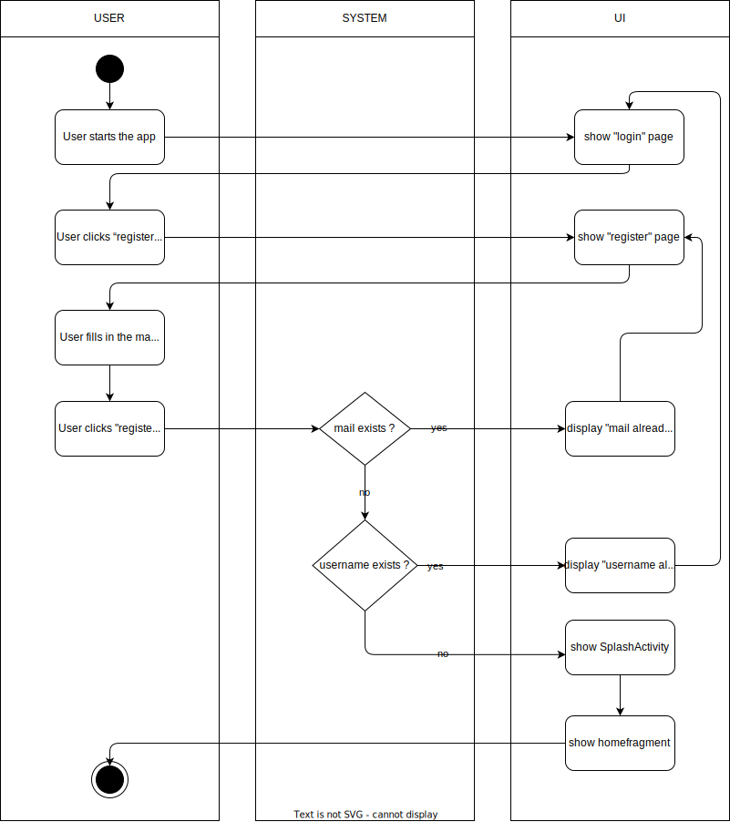
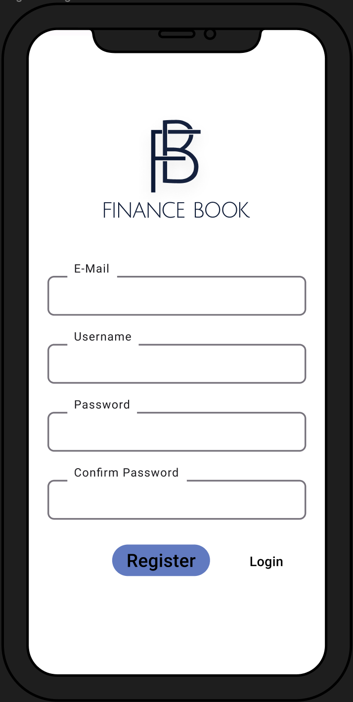

# 1. Use Case description

## Name of use case

Create an user

## 1.1 Brief Description

Each user should be able to create an useraccount using their mobile device. The data that the user must provide is as follows:
- email
- password

# 2 Flow of Events

- User starts the app. The login page opens
- User clicks register button and register page opens
- User fills in the mail, username and password
- Login-data gets checked for validity
- If the data is invalid, the user receives the error messages "mail already exists" or "username already exists"and will be returned to the register page
- After successful registration the splash activity appears


### 2.1.1 Activity Diagram



### 2.1.2 Mock-up




### 2.1.3 Narrative

```gherkin
Feature: create useraccount

  As a unregistered user,
  I want to create an useraccount

  Background:
    And I haven't got an useraccount 

  Scenario: successful registration
    Given I haven't got an existing useraccount
    When I am starting the app
    Then I am on the login page
    When I click the register button
    Then I am on the register page
    Then I register with email, username and password
    Then I click the register button again
    When I see the splash screen
    Then I am successfully registered
    
  Scenario: unsuccessful registration
    Given I haven't got an existing useraccount
    When I am starting the app
    Then I am on the login page
    When I click the register button
    Then I am on the register page
    Then I register with email, username and password
    Then I click the register button again
    When I get a error message
    Then I entered an existing username or email
```

## 2.2 Alternative Flows

(n/a)

# 3 Special Requirements

(n/a)

# 4 Preconditions

## 4.1 Registration
The user must not have an useraccount
# 5 Postconditions

(n/a)

# 6 Extension Points

(n/a)