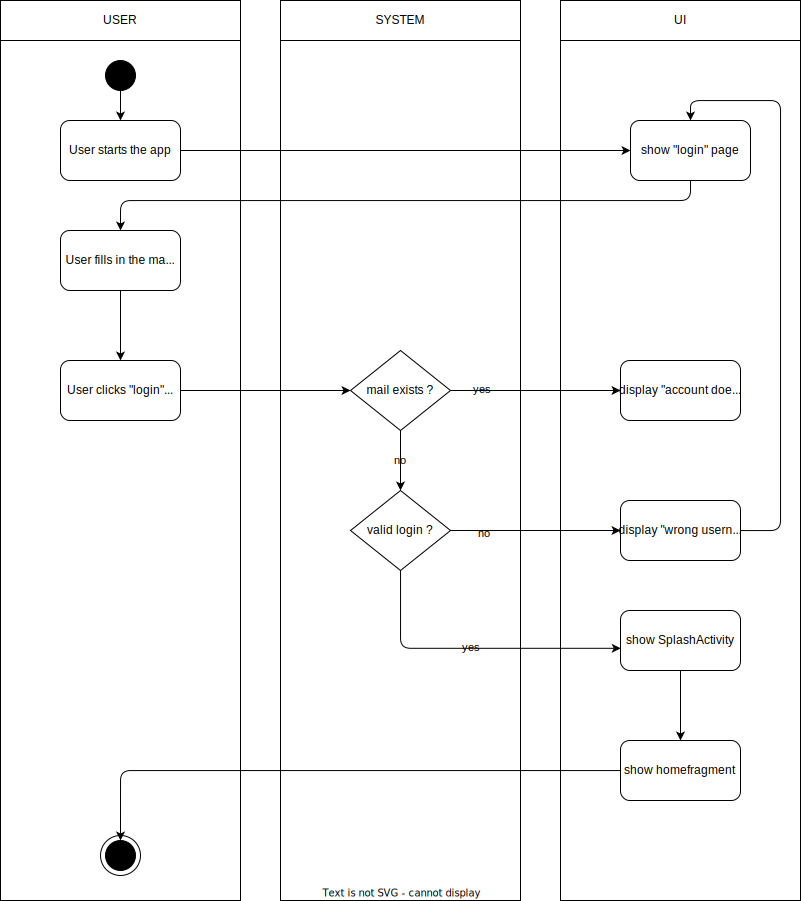

# 1. Use Case description

## Name of use case

Create account

## 1.1 Brief Description

Each user should be able to create an account using their mobile device. The data that the user must provide are as follows:

- email
- username
- password

# 2 Flow of Events

- User starts the app. The login page opens
- User fills in the mail and password
- User clicks login button
- Login-data gets checked for validity
- If the data is invalid, the user receives the error message "invalid password or mail" and will be returned to the login page
- After successful login the splash activity appears

### 2.1.1 Activity Diagram

