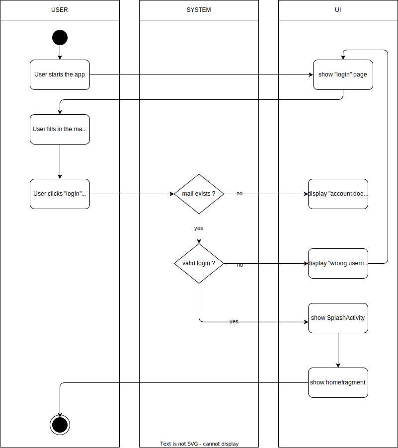

# 1. Use Case description

## Name of use case

Log in to an account

## 1.1 Brief Description

Each user should be able to log in to an account using their mobile device. The data that the user must provide is as follows:
- email
- password

# 2 Flow of Events

- User starts the app. The login page opens
- User fills in the mail and password
- User clicks login button
- Login-data gets checked for validity
- If the data is invalid, the user receives the error message "invalid password or mail" and will be returned to the login page
- After successful login the splash activity appears


### 2.1.1 Activity Diagram



### 2.1.2 Mock-up


### 2.1.3 Narrative

```gherkin
Feature: manual adding of data

  As a registered user,
  I want to log in to my account


  Background:
    And I have a account

  Scenario: successfully login
    Given I have an existing account
    When I am starting the app
    Then I am on the login page
    Then I sign in with username and password
    Then I click the login button
    When I see the splash screen
    Then I am logged in successfully
    
  Scenario: unsuccessful login
    Given I have an existing account
    When I am starting the app
    Then I am on the login page
    Then I sign in with username and password
    When I get a error message
    Then I have entered the wrong data

```

## 2.2 Alternative Flows

(n/a)

# 3 Special Requirements

(n/a)

# 4 Preconditions

## 4.1 Login

The user must have an existing account

# 5 Postconditions

(n/a)

# 6 Extension Points

(n/a)