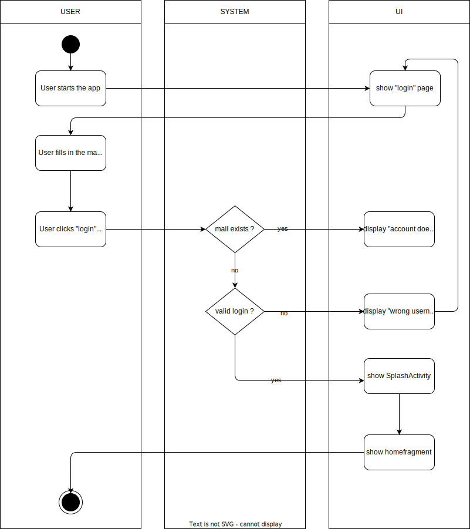

# 1. Use Case description

## Name of use case

Change added data

## 1.1 Brief Description

Every user should have the possibility to manually change the added data of a cashflow with his mobile device in case of wrong parameters. 
The following data can be customized by the user:

- store
- price
- date
- category
- an additional document
- notes

# 2 Flow of Events

## 2.1 Basic Flow

- User clicks on a specific item in the cash flow list. The page for adding data manually opens
- User can adjust various parameters
- Data gets checked for a valid format 
- If the format is not valid an error message will pop up and the User will be returned to the form. Otherwise, the data will be processed, categorized and added to the history 
- The Dashboard will be updated 
- Finally, the user is shown a success message

### 2.1.1 Activity Diagram



### 2.1.2 Narrative

```gherkin
Feature: change added data

  As a logged-in user
  I want to customize the data of a single cashflow 
  by manually entering the data to track my spent money.
  
  Background: 
    And I am on the homepage
    
    Scenario: open new "manual adding of data" form
      Given I am signed in with username "USER" and password "PASSWORD"
      And I am on the "home" page
      When I press on a specific item in the list
      Then I am on the "manual adding of data" form
      
    Scenario: adjust and save valid data
      Given I am signed in with username "USER" and password "PASSWORD"
      And I am at the "manual adding of data" form
      When I enter "store xy" in the field "Store"
      And I enter "x€" in the field "Price"
      And I enter "DD/MM/YYYY" in the field "Date"
      And I enter "category xy" in the field "Category"
      And I add a file to the form
      And I enter "note xy" in the field "Notes"
      When I press the "save" button
      Then I am on the "home" page
      And I receive a "success" message
      
    Scenario: enter invalid data and save
      Given I am signed in with username "USER" and password "PASSWORD"
      And I am at the "manual adding of data" form
      When I adjust "x€" in the "Store" field
      And I adjust "store xy" in the field "Price"
      And I press the "save" button
      Then I am at the "manual adding of data" form
      And I receive a "error" message
      
      

```


## 2.2 Alternative Flows

(n/a)

# 3 Special Requirements

(n/a)

# 4 Preconditions

## 4.1 Login

The user has to be logged into the system.

# 5 Postconditions

(n/a)

# 6 Extension Points

(n/a)


