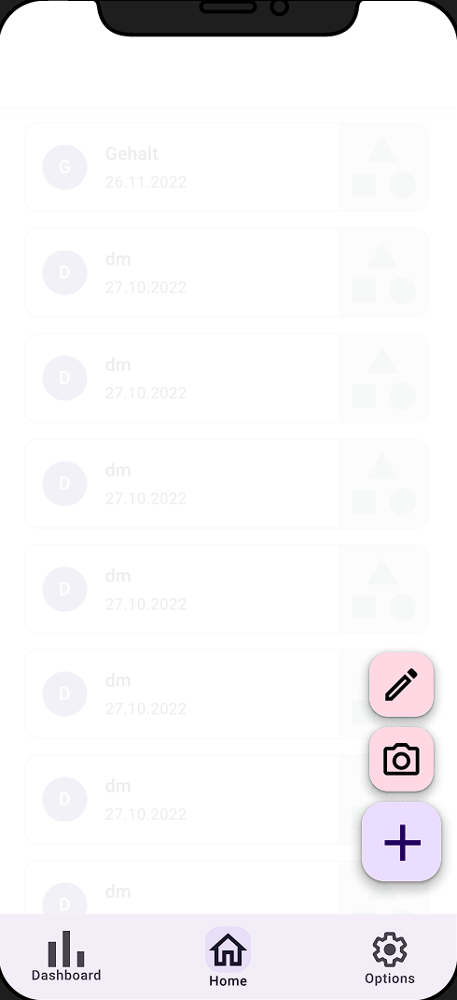

# 1. Use Case description

## Name of use case

Manual adding of data

## 1.1 Brief Description

Every user should be able to add data of a receipt manually with their mobile device. The data the user has to note is the following:

- store
- items with the respective deposited category
- price

# 2 Flow of Events

## 2.1 Basic Flow

- User clicks on "New receipt" button. An menu opens.
- User selects "Add manually" button
- Inside the app a new page with a form is shown
- User can fill out the form
- Data gets checked for a valid format
- If the format is not valid an error message will pop up and the User will be returned to the form. Otherwise, the data will be processed, categorized and added to the history.
- The Dashboard will be updated
- Finally, the user is shown a success message

### 2.1.1 Activity Diagram


### 2.1.2 Mock-up




### 2.1.3 Narrative

```gherkin
Feature: manual adding of data

  As a signed in user
  I want to add a receipt by manually entering the data
  in order to track my spent money.

  Background:
    And I am on the homepage

  Scenario: open new manuall adding of data form
    Given I am signed in with username "USER" and password "PASSWORD"
    And I am on the "home" page
    When I press the "New receipt" button
    Then I see two additional buttons "Add manually" and "Scan receipt" fade in
    When I press the "Add manually" button
    Then I am on the "manuall adding of data" form

  Scenario: enter valid data and save it
    Given I am signed in with username "USER" and password "PASSWORD"
    And I am at the "manuall adding of data" form
    When I enter "store xy" in the field "Store"
    And I enter "item xy" in the field "Item"
    And I enter "category xy" in the field "Item Category"
    And I enter "x€" in the field "Item price"
    When I press the "add item" button
    Then I see a new row for a new Item.
    When I press the "save" button
    Then I am on the "home" page
    And I receive a "success" message

  Scenario: enter invalid data and save the operation
    Given I am signed in with username "USER" and password "PASSWORD"
    And I am at the "manuall adding of data" form
    When I enter "store xy" in the field "Store"
    And I enter "x€" in the field "Item"
    And I enter "category xy" in the field "Item Category"
    And I enter "item xy" in the field "Item price"
    And I press the "save" button
    Then I am at the "manuall adding of data" form
    And I receive a "error" message
```

## 2.2 Alternative Flows

(n/a)

# 3 Special Requirements

(n/a)

# 4 Preconditions

## 4.1 Login

The user has to be logged in to the system.

# 5 Postconditions

(n/a)

# 6 Extension Points

(n/a)
