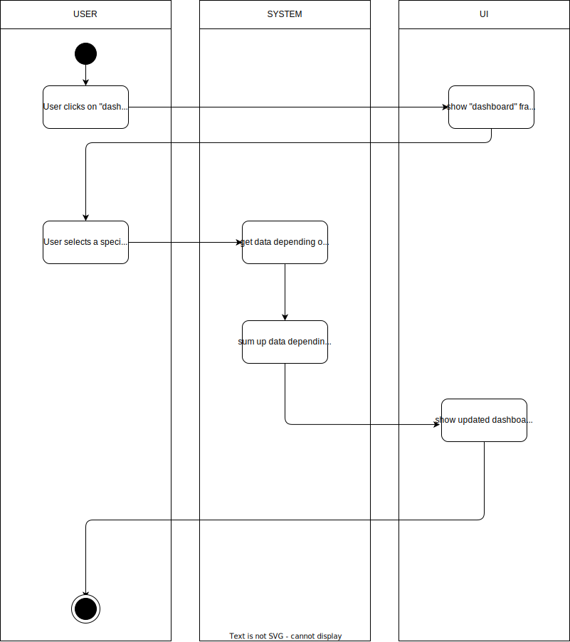

# 1. Use Case description

## Name of use case

Manual adding of data

## 1.1 Brief Description

Every user should have the possibility to visualize his cash flow in a diagram according to categories and depending on a period of time. The following data are visualized:

- summed cash flow 
per category depending on period


# 2 Flow of Events

## 2.1 Basic Flow

- User clicks on dashboard
- User selects a specific time slot
  Data gets checked for availability depending on the time period
- If more than one cash flow of a category is available, the value is summed up
- The Dashboard will be updated

### 2.1.1 Activity Diagram



### 2.1.2 Mock-up


### 2.1.3 Narrative

```gherkin
Feature: manual adding of data

  As a signed in user
  I want to add a receipt by manually entering the data
  in order to track my spent money.

  Background:
    And I am on the homepage

  Scenario: open new "manual adding of data" form
    Given I am signed in with username "USER" and password "PASSWORD"
    And I am on the "home" page
    When I press the "New receipt" button
    Then I see two additional buttons "Add manually" and "Scan receipt" fade in
    When I press the "Add manually" button
    Then I am on the "manual adding of data" form

  Scenario: enter valid data and save it
    Given I am signed in with username "USER" and password "PASSWORD"
    And I am at the "manual adding of data" form
    When I enter "store xy" in the field "Store"
    And I enter "x€" in the field "Price"
    And I enter "DD/MM/YYYY" in the field "Date"
    And I enter "category xy" in the field "Category"
    And I add a file to the form
    And I enter "note xy" in the field "Notes"
    When I press the "save" button
    Then I am on the "home" page
    And I receive a "success" message

  Scenario: enter invalid data and save the operation
    Given I am signed in with username "USER" and password "PASSWORD"
    And I am at the "manual adding of data" form
    When I enter "x€" in the field "Store"
    And I enter "store xy" in the field "Price"
    And I enter "DD/MM/YYYY" in the field "Date"
    And I press the "save" button
    Then I am at the "manual adding of data" form
    And I receive a "error" message
```

## 2.2 Alternative Flows

(n/a)

# 3 Special Requirements

(n/a)

# 4 Preconditions

## 4.1 Login

The user has to be logged in to the system.

# 5 Postconditions

(n/a)

# 6 Extension Points

(n/a)
