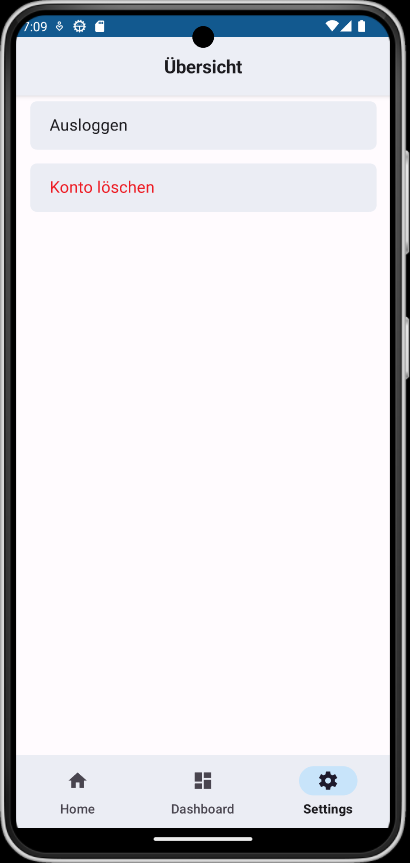
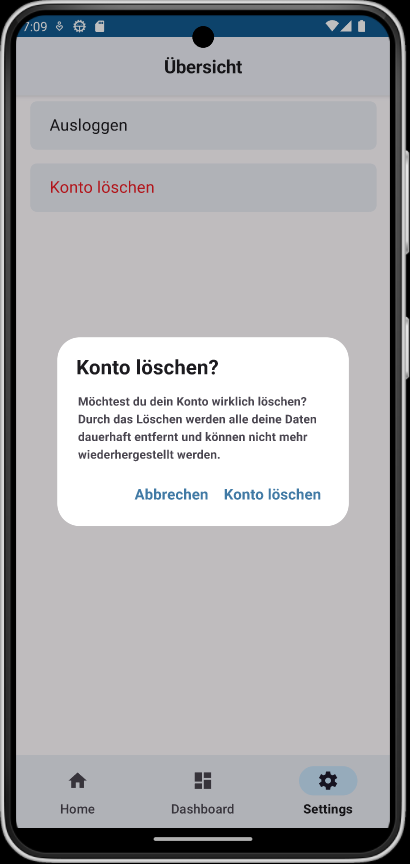

# 1. Use Case description

## Name of use case

Delete user

## 1.1 Brief Description

Every user should have the possibility to delete their related personal information including everything they have
stored in the FiBo app.

# 2 Flow of Events

## 2.1 Basic Flow

- The user clicks on the settings page
- The user clicks on the delete user account button
- The user receives a confirmation dialog
- If the user confirms the dialog the following things will happen:
  - the users personal data will be deleted from the app
  - the users private accounts including their stored cashflows will be deleted
  - the user will be deleted from every shared account
  - the user will be prompted to the login page
- If the user cancels the dialog, nothing happens.

### 2.1.1 Activity Diagram


### 2.1.2 Mock-up





### 2.1.3 Narrative

```gherkin
Feature: delete user

  As a logged-in user
  I want to delete my user data and all my data I added to the App

  Background:
    And I am on the settings page

  Scenario: successful account deletion
    Given I am signed in with email "EMAIL" and password "PASSWORD"
    And I am on the "settings" page
    When I press on the Button with the red title "Account löschen"
    Then I receive a confirm dialog
    When I confirm the deletion
    Then All my data will be deleted from the app
    And I am on the "login" page
    When I try to log in with email "EMAIL" and password "PASSWORD"
    Then The login will not be successful

  Scenario: canceled account deletion
    Given I am signed in with email "EMAIL" and password "PASSWORD"
    And I am on the "settings" page
    When I press on the Button with the red title "Account löschen"
    Then I receive a confirm dialog
    When I cancel the deletion process
    Then I am still logged in with email "EMAIL" and password "PASSWORD"
    And on the "settings" page
    And all my data is still existent

  Scenario: successful account deletion
    Given I am signed in with email "EMAIL" and password "PASSWORD"
    And I am on the "settings" page
    When I press on the Button with the red title "Account löschen"
    Then I receive a confirm dialog
    When I confirm the deletion process
    Then An error occurs during the deletion process
    Then I am still logged in with email "EMAIL" and password "PASSWORD"
    And on the "settings" page
    And all my data is still existent

```

## 2.2 Alternative Flows

(n/a)

# 3 Special Requirements

(n/a)

# 4 Preconditions

## 4.1 Login

The user has to be logged into the system.

# 5 Postconditions

- The user has to be logged out of the system.
- The user is not connected to any existent cashflow anymore.
- The user is not able to log in with his old credentials.

# 6 Extension Points

(n/a)


