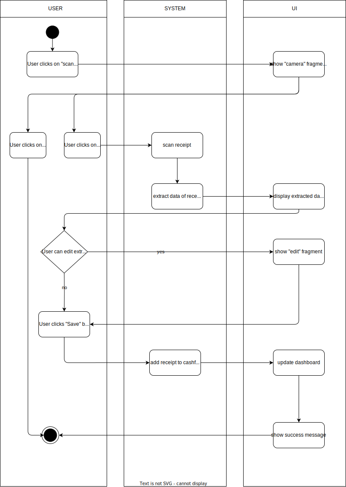

# 1. Use Case description

## Name of use case

Scanning receipt

## 1.1 Brief Description

Every user should be able to create a cashflow by taking a photo of the receipt

# 2 Flow of Events

## 2.1 Basic Flow

- The user takes a photo of the receipt using their camera
- The app automatically crops and adjusts the image for clarity
- The app extracts relevant information from the scanned receipt, such as the value and total amount
- The extracted information is displayed to the user for confirmation
- If the information ist correct, the user saves it to their cashflow
- If the information is incorrect, the user can make manual adjustments before saving it

### 2.1.1 Activity Diagram



### 2.1.2 Mock-up


### 2.1.3 Narrative

```gherkin
Feature: scanning receipt

  As a logged-in user
  I want to scan a receipt by taking a photo
  
  Background: 
    And I am on the home page
    
    Scenario: successfully scan and save receipt 
      Given I am signed in with username "USER" and password "PASSWORD"
      And I am on the "dashboard" page
      When I click on "New receipt" button
      Then I can see a menu
      And I press the "Scan receipt" button
      Then I am on the "camera" framgent
      When I take a photo of the receipt
      Then the app automatically crops and optimizes the image
      And the app extracts relevant information
      And the extracted information is displayed for confirmation
      When I confirm the information is correct
      Then I save it to my cashflows
      
    Scenario: incorrect information extraction
      Given I am signed in with username "USER" and password "PASSWORD"
      And I am on the "dashboard" page
      When I press the "camera" button
      Then I am on the "camera" fragment
      When I take a photo of the receipt
      Then the app automatically crops and optimizes the image
      And the app extracts relevant information
      And the extracted information is displayed for confirmation
      When I notice a incorrect information
      Then I make manual adjustments
      And I save the corrected information to my cashflow
      And I save it to my cashflows

      
    Scenario: discard receipt
      Given I am signed in with username "USER" and password "PASSWORD"
      And I am on the home fragment
      When I press the "camera" button
      Then I am on the "camera" fragment
      When I take a photo of the receipt
      Then the app automatically crops and optimizes the image
      And the app extracts relevant information
      And the extracted information is displayed for confirmation
      When I want to discard the receipt
      Then I delete the scanned image
      And I return to the home fragment
      
      

```


## 2.2 Alternative Flows

(n/a)

# 3 Special Requirements

The application must have access to the users phone camera

# 4 Preconditions

## 4.1 Login

The user has to be logged into the system.

# 5 Postconditions

The extracted information from the receipt is saved to the user's cashflow

# 6 Extension Points

(n/a)


